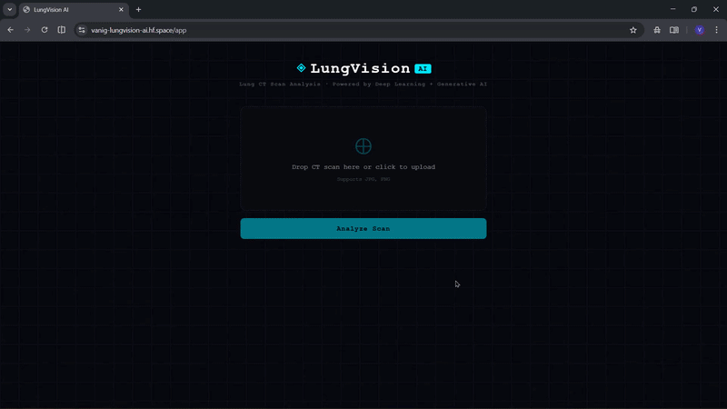

# LungVision AI 🫁

- End-to-End AI System for Lung Cancer Detection from CT Scans

- LungVision AI is a full-stack AI application that detects lung cancer from CT scans and explains predictions in plain, human-readable language. It combines deep learning, explainable AI, and generative AI to simulate a real-world medical AI pipeline.

# Live Demo

Try it live → [vanig-lungvision-ai.hf.space/app](https://vanig-lungvision-ai.hf.space/app)

#  What This Project Does?

- User uploads a lung CT scan
- Deep learning model predicts **Benign**, **Malignant**, or **Normal**
- Grad-CAM highlights the region influencing the prediction
- LLaMA 3.1 generates a clear, human-readable explanation
- Results displayed via a clean web UI

#  Model Performance

| Metric | Score|
|--------|------|
| Training Accuracy | 100% |
| Validation Accuracy | 95.7% |
| Test Accuracy | 95.8% |

Achieved using transfer learning and fine-tuning on a limited medical dataset, following standard medical AI research practices.

#  Local Setup

1. git clone https://github.com/vani-g0344/LungVision-AI.git
2. cd LungVision-AI
3. pip install -r requirements.txt
4. python download_model.py
4. cp .env.example .env        # add your GROQ_API_KEY
5. uvicorn backend.app:app --reload

#  Dataset

- 1,097 CT scans
- 3 classes: Benign · Malignant · Normal

#  Technical Stack

**Machine Learning / AI**
(i) PyTorch + TorchVision
(ii) ResNet50 (ImageNet pretrained, fine-tuned on CT scans)
(iii) Grad-CAM for visual explainability
(iv) LLaMA 3.1 via Groq API for natural language explanations

**Backend**
- FastAPI · Uvicorn · Python 3.11

**Frontend**
- HTML · CSS · JavaScript

**Training**
- Google Colab (GPU)

#  Author

**Vani Gupta**
Second-year | Computer Science Undergraduate
Aspiring Gen-AI Engineer · Full-Stack AI Developer

# ⚠️ Disclaimer

For educational and research purposes only. Not intended for clinical diagnosis. Always consult a qualified medical professional.